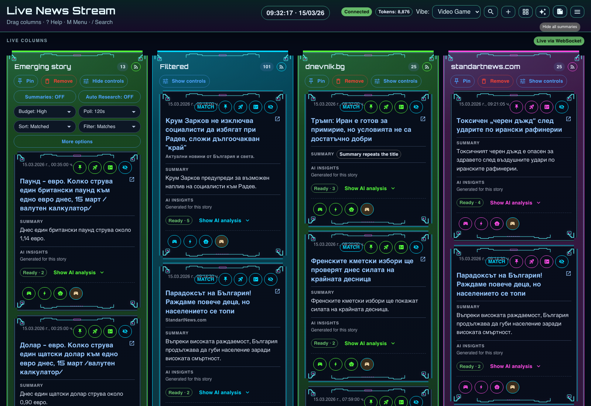
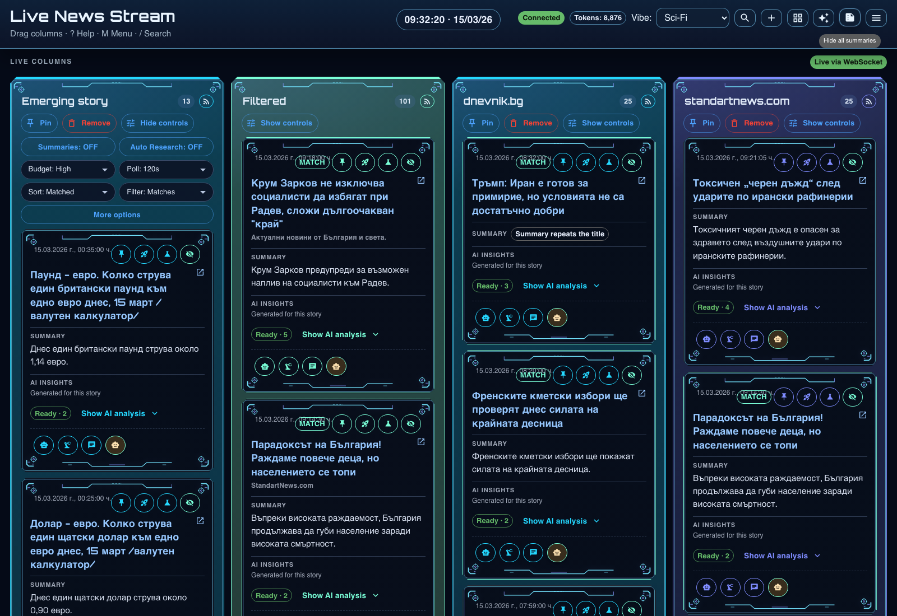
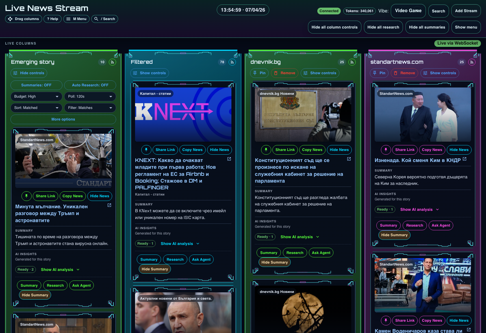
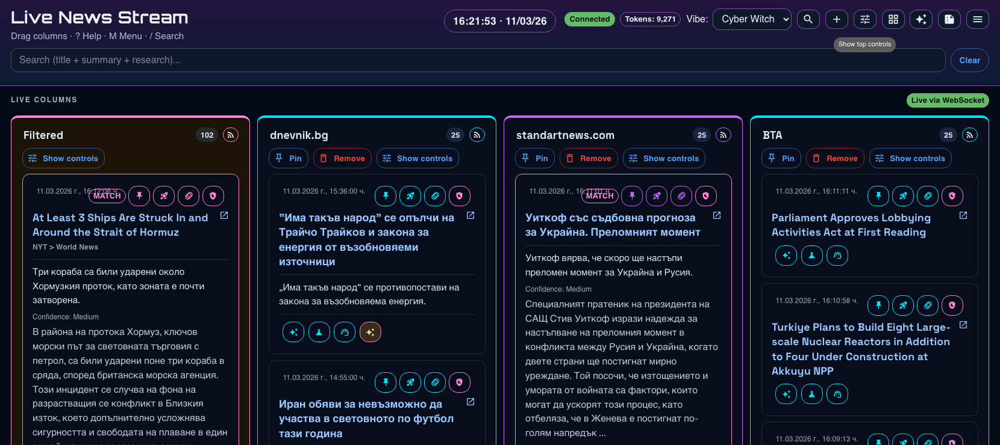
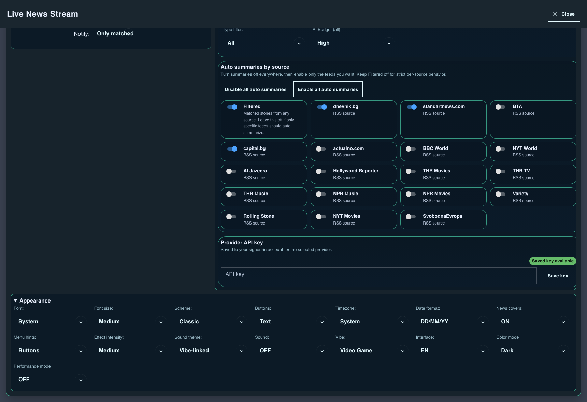
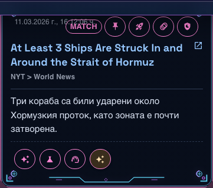
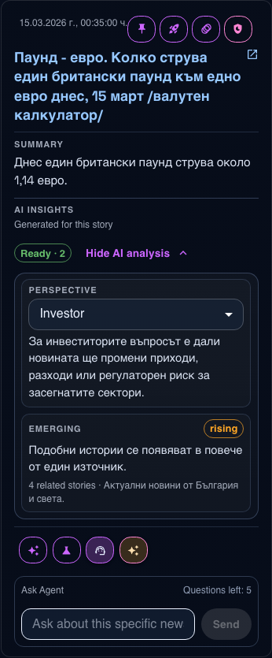

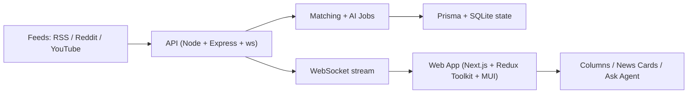

# Real-Time AI News Dashboard

[](https://github.com/donetian-petkov/ai_news_next_node/actions/workflows/ci.yml)


Real-Time AI News Dashboard is a multi-column AI news dashboard with live feed updates, AI summaries, AI research, Ask-Agent Q&A, advanced feed controls, and theme/vibe customization.

## Recent Additions

- Per-feed Discord webhook delivery. Add one webhook per feed to send newly ingested stories into a Discord channel.
- Discord posts now follow the feed’s AI toggles. If summary, translation, or research is enabled for that feed, those sections are included in the Discord message.
- Local LLM provider support. You can point the app at an OpenAI-compatible local server and use it without a provider API key.
- Feed error logs are persisted so repeated fetch failures can be inspected later.

## Product Snapshot

| Area | What you get |
|---|---|
| Live ingestion | RSS / Reddit / YouTube streams over WebSocket |
| AI workflows | Summary, Research, Ask Agent (per-news contextual chat) |
| AI insights | Optional per-story bias, headline risk, keywords, impact, perspectives, comparisons, scenarios, local impact |
| Stream control | Per-column budget, polling, sort, filters, pin/remove, age cleanup |
| UX controls | Top menu + mobile drawer, shortcuts, notifications, EN/BG interface |
| Personalization | Vibes, schemes, fonts, button modes, performance mode |
| Persistence | Prisma + SQLite for app/server state, localStorage for UI prefs |

## Core Features

### News + Columns
- Real-time column updates over WebSocket.
- Drag-and-drop column reordering.
- Filtered column for matched items.
- Per-column news limit behavior:
  - default visible count = 10
  - show +5 incrementally
  - reset back to 10 (column and global)

### AI Behaviors
- AI provider switching from UI (`OpenAI`, `Claude`, `OpenRouter`, `Local`) with runtime key prompt for cloud providers.
- Cloud providers use the signed-in account's saved key; local provider uses an OpenAI-compatible endpoint and does not need a key.
- Summary and Research language controls.
- Per-column AI budget (`low`, `standard`, `high`) + global apply-all budget.
- Ask Agent per news item with remaining-question limits and contextual replies.
- Optional AI insight features per story:
  - bias detection
  - sensationalism / headline risk detection
  - keyword extraction
  - story impact
  - perspective simulator
  - topic tracking
  - emerging story signal
  - historical comparison
  - future scenarios
  - local impact
- New AI insight features are off by default and can be enabled from the top menu.
- AI analysis is collapsed by default on each card and rendered as a separate section below Summary / Research.
- Cached stories are reprocessed immediately when AI insight settings or research language change, so already-loaded items update without waiting for a fresh poll.
- Mood and Type filters (disabled automatically in performance mode).
- AI-off fallback behavior (UI indicates unavailable AI features).

### AI Insight Card Behavior
- Summary remains the main story text.
- Research remains a separate long-form block when available.
- AI analysis is an optional collapsed section with its own heading and readiness state.
- The `Keywords` block is intentionally lightweight and may list named entities / quoted fragments rather than full factual sentences.
- Historical comparison shows the main comparison first, with any extra comparisons listed as secondary context.
- Future scenario is explicitly marked as speculative.

### Interaction + UX
- Top quick actions: Search, Add Stream, Toggle controls/menu, hide all research/summaries.
- Notification modes:
  - only matched
  - matched + pinned columns
  - only pinned columns
  - all columns
- Stackable dismissible toasts for connection/feed problems.
- Per-feed Discord webhook field in the feed controls.
- EN/BG interface.
- Responsive mobile drawer for top controls.

### Rendering + Performance
- Batched WebSocket updates to reduce render churn.
- Lazy hydration for below-fold columns.
- Dedicated performance mode for reduced visual overhead.
- Component split for maintainability (SOLID/DRY):
  - `ReactColumnsPreview` orchestrator
  - `FeedColumn` presenter
  - `NewsCard` presenter
  - extracted `top-menu/*` sections

## Visual Walkthrough

### Vibe Modes (same structure, different frame language)
Video Game vibe:



Sci-Fi vibe:



Fantasy vibe:



Cyber Witch vibe:


### Performance Mode
Performance mode with reduced visual effects for lower render overhead:



### Top Controls (expanded settings)
Expanded top controls panel with AI/appearance sections:



### News Card (ornamented frame + actions + AI detail panels)
Example card in Cyber Witch with cover media, action rows, summary, and expanded AI detail panels:



### Ask Agent (per-news contextual chat)
Ask Agent panel below a news card:



### Column Controls (mobile layout)
Per-column controls and card preview in mobile view:



### Screenshot File Map
Store screenshots in `docs/screenshots/` with these exact names:
- `vibe-video-game-columns.png`
- `vibe-scifi-columns.png`
- `vibe-fantasy-columns.png`
- `vibe-cyber-witch-columns.png`
- `performance-mode-view.png`
- `top-controls-expanded.png`
- `news-card-research-cyberwitch.png`
- `news-card-ask-agent.png`
- `mobile-column-controls.png`

## Architecture



## Monorepo Layout

```text
ai_news_next_node/
  apps/
    api/            # ingestion, matching, AI orchestration, websocket server
    web/            # Next.js client app + Redux + MUI
  packages/
    shared/         # zod contracts + shared TS types
```

## Quick Start

### 1) Prerequisites
- Node.js `20+`
- npm `10+`

### 2) Configure environment
Copy `.env.example` to `.env`:

```bash
cp .env.example .env
```

Minimum required values:

```env
OPENAI_API_KEY=...
NEXT_PUBLIC_WS_URL=ws://localhost:4000
DATABASE_URL="file:./dev.db"
```

### 3) Install + initialize

```bash
npm install
npm run prisma:generate
npm run prisma:migrate
```

### 4) Run locally

```bash
npm run dev
```

Endpoints:
- Web: `http://localhost:3000`
- API health: `http://localhost:4000/health`
- WebSocket: `ws://localhost:4000`

### Notes
- Sign in is required for cloud providers and saved provider keys.
- Local provider mode does not need a provider key.
- Per-feed Discord webhooks can be added from the feed controls.

## Run With Docker (Everything Included)

This runs both services (`web` + `api`) with one command and persists SQLite data in a Docker volume.

### 1) Prepare `.env`

```bash
cp .env.example .env
```

Set at least:

```env
OPENAI_API_KEY=...
KEYWORDS=keyword1,keyword2
NEXT_PUBLIC_WS_URL=ws://localhost:4000
```

### 2) Build and start containers

```bash
docker compose up -d --build
```

### 3) Verify
- Web: `http://localhost:3000`
- API health: `http://localhost:4000/health`

### 4) Logs

```bash
docker compose logs -f api
docker compose logs -f web
```

### 5) Stop

```bash
docker compose down
```

### 6) Reset everything (including SQLite volume)

```bash
docker compose down -v
```

### Notes
- API container runs `prisma migrate deploy` automatically before starting server.
- SQLite data persists in volume: `api_sqlite`.
- For public domain deployment, set `NEXT_PUBLIC_WS_URL` to your public `wss://...` endpoint before `docker compose up --build`.

## Host Online From Your Own Computer (Mac)

This option exposes your local app to the internet without VPS costs, using Cloudflare Tunnel.

### What you need
- A domain in Cloudflare DNS
- `cloudflared` installed
- Your Mac kept awake and online

### 1) Set production env values
In root `.env`:

```env
PORT=4000
OPENAI_API_KEY=YOUR_KEY
KEYWORDS=keyword1,keyword2
DATABASE_URL="file:/Users/<your-user>/ai_news/ai_news_next_node/apps/api/prisma/dev.db"
NEXT_PUBLIC_WS_URL=wss://api.yourdomain.com
```

### 2) Install, migrate, build

```bash
npm install
npm run prisma:generate
npm run prisma:migrate
npm run build
```

### 3) Start app locally (prod mode)

```bash
npm run start
```

Verify:

```bash
curl -s http://localhost:4000/health
```

### 4) Keep processes alive with PM2

```bash
npm i -g pm2
pm2 start "npm run start -w @ai-news/api" --name ai-news-api
pm2 start "npm run start -w @ai-news/web" --name ai-news-web
pm2 save
pm2 startup
```

### 5) Install and authenticate Cloudflare Tunnel

```bash
brew install cloudflared
cloudflared tunnel login
cloudflared tunnel create ai-news-home
cloudflared tunnel route dns ai-news-home app.yourdomain.com
cloudflared tunnel route dns ai-news-home api.yourdomain.com
```

### 6) Create tunnel config
Create `~/.cloudflared/config.yml`:

```yml
tunnel: ai-news-home
credentials-file: /Users/<your-user>/.cloudflared/<TUNNEL_ID>.json

ingress:
  - hostname: app.yourdomain.com
    service: http://localhost:3000
  - hostname: api.yourdomain.com
    service: http://localhost:4000
  - service: http_status:404
```

### 7) Run tunnel in background

```bash
pm2 start "cloudflared tunnel run ai-news-home" --name ai-news-tunnel
pm2 save
```

### 8) Verify public endpoints
- App: `https://app.yourdomain.com`
- API health: `https://api.yourdomain.com/health`
- WebSocket target from web: `wss://api.yourdomain.com`

### 9) Update flow after changing env/build
If `NEXT_PUBLIC_*` or frontend code changes:

```bash
npm run build
pm2 restart ai-news-web ai-news-api
```

### Notes
- If your Mac sleeps or shuts down, service goes offline.
- Back up `apps/api/prisma/dev.db` regularly.
- For heavier traffic, migrate from SQLite to Postgres.

## Host Online From Your Own Computer (Windows 11)

This option exposes your local app to the internet without VPS costs, using Cloudflare Tunnel.

### What you need
- A domain in Cloudflare DNS
- `cloudflared` installed
- Your Windows machine kept awake and online

### 1) Set production env values
In root `.env`:

```env
PORT=4000
OPENAI_API_KEY=YOUR_KEY
KEYWORDS=keyword1,keyword2
DATABASE_URL="file:C:/Users/<your-user>/ai_news/ai_news_next_node/apps/api/prisma/dev.db"
NEXT_PUBLIC_WS_URL=wss://api.yourdomain.com
```

### 2) Install, migrate, build

```powershell
npm install
npm run prisma:generate
npm run prisma:migrate
npm run build
```

### 3) Start app locally (prod mode)

```powershell
npm run start
```

Verify:

```powershell
curl http://localhost:4000/health
```

### 4) Keep processes alive with PM2

```powershell
npm i -g pm2
pm2 start "npm run start -w @ai-news/api" --name ai-news-api
pm2 start "npm run start -w @ai-news/web" --name ai-news-web
pm2 save
```

At login/startup, run:

```powershell
pm2 resurrect
```

### 5) Install and authenticate Cloudflare Tunnel

```powershell
winget install Cloudflare.cloudflared
cloudflared tunnel login
cloudflared tunnel create ai-news-home
cloudflared tunnel route dns ai-news-home app.yourdomain.com
cloudflared tunnel route dns ai-news-home api.yourdomain.com
```

### 6) Create tunnel config
Create `%USERPROFILE%\.cloudflared\config.yml`:

```yml
tunnel: ai-news-home
credentials-file: C:\Users\<your-user>\.cloudflared\<TUNNEL_ID>.json

ingress:
  - hostname: app.yourdomain.com
    service: http://localhost:3000
  - hostname: api.yourdomain.com
    service: http://localhost:4000
  - service: http_status:404
```

### 7) Run tunnel in background

```powershell
pm2 start "cloudflared tunnel run ai-news-home" --name ai-news-tunnel
pm2 save
```

### 8) Verify public endpoints
- App: `https://app.yourdomain.com`
- API health: `https://api.yourdomain.com/health`
- WebSocket target from web: `wss://api.yourdomain.com`

### 9) Update flow after changing env/build
If `NEXT_PUBLIC_*` or frontend code changes:

```powershell
npm run build
pm2 restart ai-news-web ai-news-api
```

### Notes
- If your PC sleeps, hibernates, or shuts down, service goes offline.
- Ensure Windows Firewall allows local ports `3000` and `4000` for local loopback app access.
- Back up `apps/api/prisma/dev.db` regularly.
- For heavier traffic, migrate from SQLite to Postgres.

## Scripts

```bash
# Development
npm run dev
npm run dev:web
npm run dev:api

# Build + start
npm run build
npm run start

# Tests
npm run test
npm run test:all
npm run test -w @ai-news/web
npm run test -w @ai-news/shared

# Prisma
npm run prisma:generate
npm run prisma:migrate
```

## Environment Reference

### Core
- `PORT` (default: `4000`)
- `NEXT_PUBLIC_WS_URL` (default: `ws://localhost:4000`)
- `DATABASE_URL` (example: `file:./dev.db`)

### AI Provider + Keys
- `AI_PROVIDER` (`openai` | `claude` | `openrouter`, default `openai`)
- `OPENAI_API_KEY`
- `ANTHROPIC_API_KEY` (or `CLAUDE_API_KEY`)
- `OPENROUTER_API_KEY`
- `OPENROUTER_BASE_URL` (optional override)

### AI Behavior
- `AI_ENABLED` (`true`/`false`)
- `SUMMARY_LANG` (`bilingual` | `bg` | `en`)
- `RESEARCH_LANG` (`bg` | `en`)
- `OPENAI_EMBED_MODEL`
- `OPENAI_SUMMARY_MODEL`
- `OPENAI_RESEARCH_MODEL`
- `OPENROUTER_SUMMARY_MODEL`
- `OPENROUTER_RESEARCH_MODEL`

### Matching / Dedupe
- `KEYWORDS` (comma-separated)
- `MATCH_THRESHOLD`
- `DEDUPE_THRESHOLD`
- `FILTERED_AI_DEDUPE`
- `FILTERED_DEDUPE_THRESHOLD`

## Keyboard Shortcuts

| Shortcut | Action |
|---|---|
| `?` / `H` | Open/close Help |
| `M` | Toggle menu |
| `C` | Toggle top controls |
| `G` | Toggle all column controls |
| `S` | Toggle Search section |
| `/` | Focus Search |
| `A` | Toggle Add Stream section |
| `T` | Cycle color mode |
| `V` | Cycle vibe |
| `Esc` | Close Help |

## Testing Scope

Current automated coverage includes:
- Redux slices: `ui`, `feeds`, `news`, `connection`, `aiUsage`
- WebSocket client lifecycle + message mapping
- Shared `zod` schema contracts in `packages/shared`

Run:

```bash
npm run test
```

## Troubleshooting

### API is healthy but UI says `Disconnected`
- Verify `NEXT_PUBLIC_WS_URL` points to the running API websocket host/port.
- Ensure API is reachable from browser network context.
- Check browser devtools for WS handshake errors.

### Prisma error: `Environment variable not found: DATABASE_URL`
- Add `DATABASE_URL` in root `.env`.
- Re-run:
  - `npm run prisma:generate`
  - `npm run prisma:migrate`

### AI shows unavailable despite key
- Confirm key exists for selected provider.
- If provider changed in UI, provide key in the prompt dialog.
- Restart API after changing env keys.

### Slow rendering on local machine
- Enable Performance mode in Appearance.
- Reduce open columns and heavy auto-AI operations.
- Keep tests/build watchers off when not needed.

## CI

Workflow: `.github/workflows/ci.yml`

Pipeline runs:
- dependency install
- Prisma generate/migrate
- unit tests
- monorepo build

## Release Notes

- Active changelog: [RELEASE_NOTES.md](./RELEASE_NOTES.md)
- Releases: [GitHub Releases](https://github.com/donetian-petkov/ai_news_next_node/releases)
